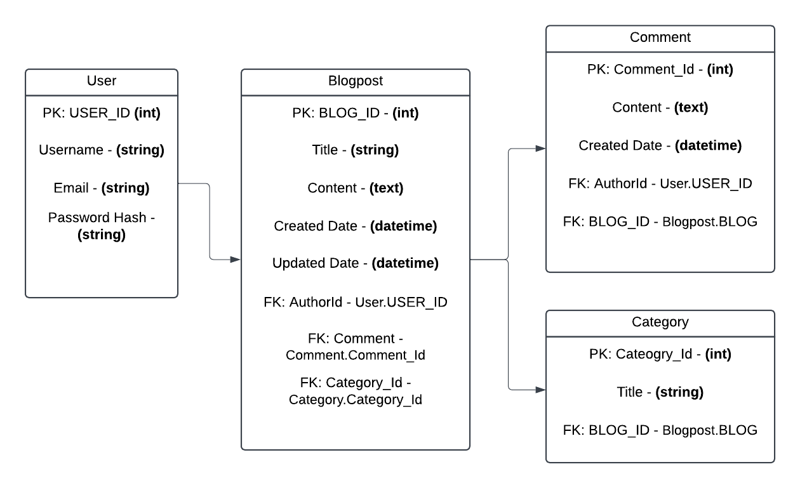

# Blog and Content Management System

This is a Full Stack Web App made in .NET to help users create and persist themselves as authors anf their blog posts/content to a backend. 

## Project Members
- Puneet Gupta

## Project Requirements
- Application must build and run.
- Unit Testing (70% code coverage for Services and Models layer)
- Utilize an external API (https://docs.mistral.ai/api/) -> Summarize blog content using llm api.
- Backend hosted on Azure Cloud Service

## Tech Stack

- React/JS (Front End)
- C# (Back End Programming Language)
- SQL Server (Azure Hosted)
- EF Core (ORM Tech)
- ASP.NET (Web API Framework)
- HTML, CSS
    - Bootstrap? Tailwind? 

## User Stories
- User should be able to login/logout if they already have an account.
- User should be able to register if they do not have an account.
- User should be able to create a new blog post, delete a blog post.
- User should be able to edit existing personal posts.
- User should be able to tag and categorize posts before posting.
- User should be able to browse and read other articles, view blog post details.
- User should be able to search for content, search for specific keywords or categories to quickly find relevant blog posts.
- User should be able to see all blogs from a specific author.

## Tables

## MVP Goals
- User(s) can create a new blog post, with a category, title, and content
- User(s) can leave a comment on a blog they read.
- User(s) can delete their own blog(s)
- User(s) have the option to summarize a blog/get a TLDR, if they dont want to read the whole thing.
- User(s) can edit their own blog content.

## Stretch Goals
- Implement login/logout and register functionality to allow for multiple users
- User authentication and password encryption
- Add a follower list to customize feed
- Add user replies
- Add real-time messaging
- Login using google, facebook account